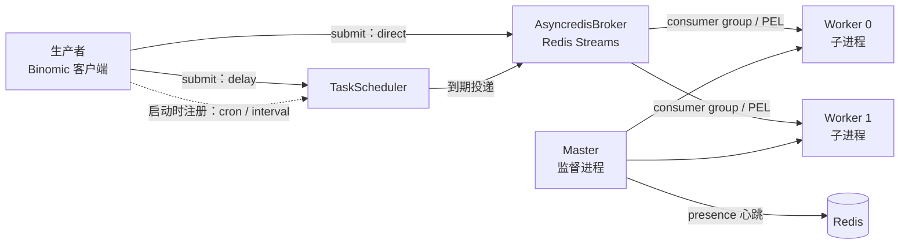

<div align="center">

# Binomic

基于 anyio 与 Redis Streams 的异步任务框架

[中文] **·** [English](README_en.md)

[](https://github.com/Ahsen17/binomic/actions/workflows/pytest.yml)
[](LICENSE)
[](pyproject.toml)

</div>

---

## 简介

Binomic 是一个自定义异步任务框架：以装饰器声明任务，以 Redis Streams 投递消息，
由多进程 Worker 消费执行，Master 进程负责监督与故障回收。消息体采用
[msgspec](https://jcristharif.com/msgspec/) JSON 序列化，任务 ID 使用 UUIDv7。

## 特性

- **声明式任务**：`@task()` 装饰器，支持 `direct`（立即）、`delay`（延迟）、
  `cron`（cron 表达式）、`interval`（固定间隔）四种模式
- **Redis Streams 消息代理**：基于消费者组与 PEL 的可靠投递，支持通过
  `xautoclaim` 回收失联消费者的消息
- **多进程 Worker**：Master 以 multiprocessing 启动多个 Worker 子进程，并携
  presence 心跳持续监督
- **类型安全**：全量 mypy strict 与 ruff 检查，任务注册表基于泛型 `TaskSpec[P, T]`
- **Litestar 集成**：内置 `BinomicPlugin`，将 Binomic 客户端注入 Litestar 依赖

## 安装

```bash
# uv
uv add binomic

# pip
pip install binomic
```

要求 Python ≥ 3.12，Redis ≥ 7.x。

## 快速上手

### 1. 声明任务

在应用包内的 `tasks.py` 模块中用装饰器声明任务（Worker 通过
`autodiscover` 自动发现所有 `tasks.py` 模块）：

```python
# myapp/tasks.py
import time

from binomic.task import task


@task("default")
def example(index: int = 0) -> None:
    print(f"[{index}] Current time: {time.time()}")


@task("default", mode="delay", delay=10)  # 延迟 10 秒执行
def delayed() -> None: ...


@task("default", mode="cron", cron="*/5 * * * *")  # 每 5 分钟执行
def periodic() -> None: ...


@task("default", mode="interval", interval=30)  # 每 30 秒执行
def poll() -> None: ...
```

第一个位置参数是队列名（需与 `queues` 配置对应），任务以函数名的小写形式注册；
`cron` 与 `interval` 模式的函数不能带参数。

### 2. 启动并投递

```python
from binomic.client import Binomic, BinomicFactory
from binomic.config import BinomicConfig
from binomic.message import Message
from binomic.task import autodiscover

# 发现 myapp 包内所有 tasks.py 模块并注册任务
autodiscover("myapp")

factory = BinomicFactory(
    broker_dsn="redis://localhost:6379/0",
    redis_dsn="redis://localhost:6379/1",
    module_name="myapp",
    config=BinomicConfig(queues=["default"], workers=2, concurrency=5),
)

binomic: Binomic = factory.create()

# 进入上下文后启动 Master（拉起 worker 子进程）并提供提交入口
async with binomic:
    await binomic.submit(Message(name="example", args=[1]))
```

消息进哪条 Stream 由任务声明里的队列决定（消息上不指定队列）；`enqueued_at` 由客户端
在投递时写入，无需手工赋值。`submit` 只支持 `direct` 与 `delay` 两种模式：`cron` 与
`interval` 任务在客户端启动时自动注册，对其调用 `submit` 会抛 `ValueError`。

### 3. Litestar 应用中集成

```python
from binomic.config import BinomicConfig
from binomic.plugin.litestar import BinomicPlugin
from litestar import Litestar

app = Litestar(
    plugins=[
        BinomicPlugin(
            app_name="myapp",
            broker_dsn="redis://localhost:6379/0",
            redis_dsn="redis://localhost:6379/1",
            config=BinomicConfig(queues=["default"]),
        )
    ],
)
```

处理器内通过 `binomic` 参数注入 `Binomic` 客户端。

## 架构



- **Producer**：`Binomic.submit` 经 `BrokerFactory` 按 broker DSN 协议创建代理并
  `enqueue` 消息；`delay` 任务交给调度器延后投递，`cron` 与 `interval` 任务不经
  `submit`，而在客户端启动时注册为周期作业。
- **Scheduler**：`TaskScheduler` 为 `delay` / `cron` / `interval` 三种模式创建对应的
  触发器，到期后走与 `direct` 相同的入队路径。
- **Broker**：`AsyncredisBroker` 将消息写入 Redis Streams，Worker 侧以消费者组
  读取；失联消费者的 PEL 消息由 `reclaim`（`xautoclaim`）回收重投。
- **Master / Worker**：Master 以 multiprocessing 拉起 Worker 子进程并监督其存活；
  Worker 在进程内通过 `anyio` 以配置并发执行任务，执行结果经 `ack` 确认。

## 开发

```bash
make install    # 初始化虚拟环境并安装依赖
make check      # lint + 类型检查 + 全部测试
make coverage   # 覆盖率报告（fail_under = 80）
make changelog  # 由 git-cliff 再生成 CHANGELOG.md
```

提交信息遵循 [Conventional Commits](https://www.conventionalcommits.org/zh-hans/)，
详见 [CONTRIBUTING.md](CONTRIBUTING.md)。

## 变更日志

[CHANGELOG.md](CHANGELOG.md) 由 [git-cliff](https://git-cliff.org) 从提交历史生成，
禁止手动编辑。

## 许可证

[MIT](LICENSE)
