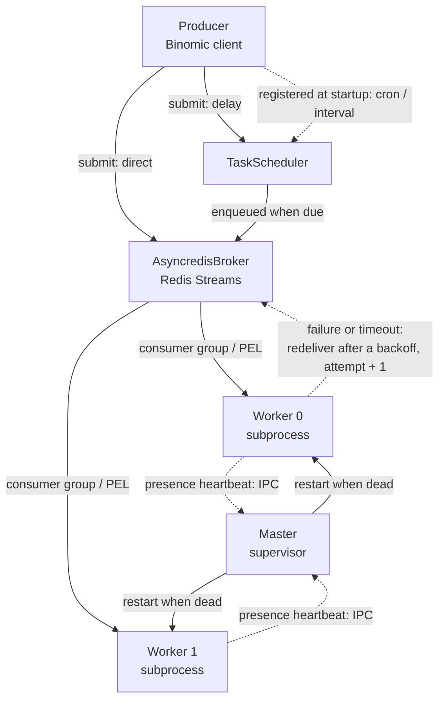

<div align="center">

# Binomic

A customized async task framework built on anyio and Redis Streams

[中文](README.md) **·** [English]

[](https://github.com/Ahsen17/binomic/actions/workflows/pytest.yml)
[](LICENSE)
[](pyproject.toml)

</div>

---

## Introduction

Binomic is a customized async task framework: tasks are declared with a
decorator, messages are delivered over Redis Streams, multiprocess workers
consume and execute them, and a master process supervises the fleet and
reclaims work from dead consumers. Message payloads are serialized with
[msgspec](https://jcristharif.com/msgspec/) JSON, and task IDs use UUIDv7.

## Features

- **Declarative tasks**: the `@task()` decorator with `direct` (immediate),
  `delay` (deferred), `cron` (cron expression), and `interval` (fixed interval)
  modes
- **Redis Streams broker**: reliable delivery built on consumer groups and the
  PEL, with `xautoclaim`-based reclaim of messages from dead consumers
- **Retries**: failed or overdue messages are redelivered after a backoff
  (1.5 seconds, doubling, capped at 30) up to `max_attempts` (3 by default)
- **Multiprocess workers**: the master spawns worker subprocesses via
  multiprocessing and supervises them with a presence heartbeat
- **Type safe**: fully mypy strict and ruff checked, with a generic
  `TaskSpec[P, T]` task registry
- **Litestar integration**: the built-in `BinomicPlugin` injects the Binomic
  client into Litestar dependencies

## Installation

```bash
# uv
uv add binomic

# pip
pip install binomic
```

Requires Python ≥ 3.12 and Redis ≥ 7.x.

## Quick start

### 1. Declare tasks

Declare tasks in a `tasks.py` module inside your application package (the
worker discovers every `tasks.py` module through `autodiscover`):

```python
# myapp/tasks.py
import time

from binomic.task import task


@task("default")
def example(index: int = 0) -> None:
    print(f"[{index}] Current time: {time.time()}")


@task("default", mode="delay", delay=10)  # runs after a 10-second delay
def delayed() -> None: ...


@task("default", mode="cron", cron="*/5 * * * *")  # runs every 5 minutes
def periodic() -> None: ...


@task("default", mode="interval", interval=30)  # runs every 30 seconds
def poll() -> None: ...
```

The first positional argument is the queue name (it must match the `queues`
configuration), and tasks are registered under the lowercase form of the
function name; functions in `cron` and `interval` mode take no arguments.

### 2. Start and submit

```python
from binomic.client import Binomic, BinomicFactory
from binomic.config import BinomicConfig
from binomic.message import Message
from binomic.task import autodiscover

# Discover and register every tasks.py module inside the myapp package
autodiscover("myapp")

factory = BinomicFactory(
    broker_dsn="redis://localhost:6379/0",
    module_name="myapp",
    config=BinomicConfig(queues=["default"], workers=2, concurrency=5),
)

binomic: Binomic = factory.create()

# Entering the context starts the master (spawning worker subprocesses)
# and exposes the submission entry point
async with binomic:
    await binomic.submit(Message(name="example", args=[1]))
```

Which stream a message lands in is decided by the queue in the task
declaration (a message does not specify one), and `enqueued_at` is written by
the client on delivery into the message's stream entry (not onto the `Message`),
so it needs no manual assignment. `submit` supports
only the `direct` and `delay` modes: `cron` and `interval` tasks are registered
automatically when the client starts, and calling `submit` on them raises
`ValueError`.

### 3. Integrate with Litestar

```python
from binomic.config import BinomicConfig
from binomic.plugin.litestar import BinomicPlugin
from litestar import Litestar

app = Litestar(
    plugins=[
        BinomicPlugin(
            app_name="myapp",
            broker_dsn="redis://localhost:6379/0",
            config=BinomicConfig(queues=["default"]),
        )
    ],
)
```

Inside handlers, the `Binomic` client is injected through the `binomic`
parameter.

## Architecture



- **Producer**: `Binomic.submit` creates a broker via `BrokerFactory` based on
  the broker DSN scheme and enqueues the message; `delay` tasks are handed to
  the scheduler for a deferred enqueue, while `cron` and `interval` tasks do
  not go through `submit` and are registered as periodic jobs when the client
  starts.
- **Scheduler**: `TaskScheduler` creates the matching trigger for each of the
  `delay` / `cron` / `interval` modes and enqueues through the same path as
  `direct` once a job is due. Each worker holds one of its own too, carrying
  the backoff of a failed redelivery.
- **Broker**: `AsyncredisBroker` writes messages to Redis Streams; workers read
  them through a consumer group, and messages stranded in a dead consumer's
  PEL are redelivered via `reclaim` (`xautoclaim`), which bumps `attempt`.
- **Master / Worker**: the master spawns worker subprocesses through
  multiprocessing and supervises their liveness. The heartbeat goes over
  **inter-process IPC** (one shared `multiprocessing.Value` per worker, created
  by the master and handed to the child through its constructor) rather than
  through Redis -- so beyond `is_alive()` it can still recognise a process that
  is up but has stopped beating; the master polls at a multiple of
  `heartbeat_interval` and terminates and rebuilds a worker the moment it is
  judged dead. Each worker executes tasks concurrently within its process via
  `anyio`. A task that succeeds is `ack`ed; one that fails or overruns is
  redelivered **after a backoff** while `max_attempts` lasts and dropped after
  that; a cancelled task is **not** `ack`ed, leaving its message to `reclaim`.

## Roadmap

The list below tracks the known gaps and the planned iteration order; a
checked box means done. For what has landed, see
[CHANGELOG.md](CHANGELOG.md).

- [ ] **P0 · Message durability** -- ack a failed message only once its retry
  has landed, and persist deferred jobs, so a process exit inside the backoff
  window can no longer drop it silently; `delay`-mode submissions need the same
  treatment -- they currently live in the client process's memory
- [ ] **P0 · Bounded storage** -- give the streams a trimming policy (`xadd`
  `maxlen` or cleanup on ack) so Redis memory does not grow without bound with
  message history
- [ ] **P1 · Configuration** -- promote `task_timeout` / `heartbeat_interval` /
  `reclaim_interval` / `read_count` / `poll_interval` to `BinomicConfig` fields
  (they are hard-coded internal defaults today)
- [ ] **P1 · Dead-letter queue** -- route messages past `max_attempts` and with
  unparseable payloads into a DLQ that can be inspected and replayed (three
  `TODO` markers in the code)
- [ ] **P2 · Multi-instance** -- make consumer names unique (e.g. an instance
  prefix) so several client instances can share one Redis database
- [ ] **P2 · Observability** -- expose metrics hooks (queue depth, stranded
  messages, worker restarts, ...), covering the external visibility lost when
  the heartbeat moved in-process

## Development

```bash
make install    # set up the virtual environment and install dependencies
make check      # lint + type check + full test suite
make coverage   # coverage report (fail_under = 80)
make changelog  # regenerate CHANGELOG.md with git-cliff
```

Commit messages follow [Conventional Commits](https://www.conventionalcommits.org/);
see [CONTRIBUTING_en.md](CONTRIBUTING_en.md) for details.

## Changelog

[CHANGELOG.md](CHANGELOG.md) is generated from the commit history by
[git-cliff](https://git-cliff.org) and must not be edited by hand.

## License

[MIT](LICENSE)
