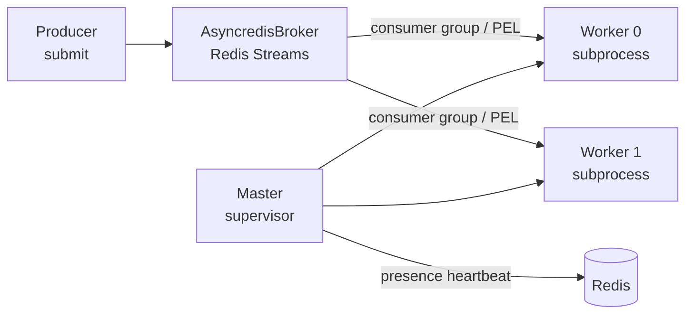

<div align="center">

# Binomic

A customized async task framework built on anyio and Redis Streams

[中文](README.md) **·** [English]

[](https://github.com/Ahsen17/binomic/actions/workflows/pytest.yml)
[](LICENSE)
[](pyproject.toml)

</div>

---

## Introduction

Binomic is a customized async task framework: tasks are declared with a
decorator, messages are delivered over Redis Streams, multiprocess workers
consume and execute them, and a master process supervises the fleet and
reclaims work from dead consumers. Message payloads are serialized with
[msgspec](https://jcristharif.com/msgspec/) JSON, and task IDs use UUIDv7.

## Features

- **Declarative tasks**: the `@task()` decorator with `direct` (immediate),
  `delay` (deferred), and `cron` (periodic) modes
- **Redis Streams broker**: reliable delivery built on consumer groups and the
  PEL, with `xautoclaim`-based reclaim of messages from dead consumers
- **Multiprocess workers**: the master spawns worker subprocesses via
  multiprocessing and supervises them with a presence heartbeat
- **Type safe**: fully mypy strict and ruff checked, with a generic
  `TaskSpec[P, T]` task registry
- **Litestar integration**: the built-in `BinomicPlugin` injects the Binomic
  client into Litestar dependencies

## Installation

```bash
# uv
uv add binomic

# pip
pip install binomic
```

Requires Python ≥ 3.12 and Redis ≥ 7.x.

## Quick start

### 1. Declare tasks

Declare tasks in a `tasks.py` module inside your application package (the
worker discovers every `tasks.py` module through `autodiscover`):

```python
# myapp/tasks.py
import time

from binomic.task import task


@task()
def example(index: int = 0) -> None:
    print(f"[{index}] Current time: {time.time()}")


@task(mode="delay", delay=10)  # runs after a 10-second delay
def delayed() -> None: ...


@task(mode="cron", cron="*/5 * * * *")  # runs every 5 minutes
def periodic() -> None: ...
```

### 2. Start and submit

```python
import time

from binomic.client import Binomic, BinomicFactory
from binomic.config import BinomicConfig
from binomic.message import Message
from binomic.task import autodiscover

# Discover and register every tasks.py module inside the myapp package
autodiscover("myapp")

factory = BinomicFactory(
    broker_dsn="redis://localhost:6379/0",
    redis_dsn="redis://localhost:6379/1",
    module_name="myapp",
    config=BinomicConfig(queues=["default"], workers=2, concurrency=5),
)

binomic: Binomic = factory.create()

# Entering the context starts the master (spawning worker subprocesses)
# and exposes the submission entry point
async with binomic:
    await binomic.submit(
        Message(name="example", queue="default", enqueued_at=time.time())
    )
```

### 3. Integrate with Litestar

```python
from binomic.config import BinomicConfig
from binomic.plugin.litestar import BinomicPlugin
from litestar import Litestar

app = Litestar(
    plugins=[
        BinomicPlugin(
            app_name="myapp",
            broker_dsn="redis://localhost:6379/0",
            redis_dsn="redis://localhost:6379/1",
            config=BinomicConfig(queues=["default"]),
        )
    ],
)
```

Inside handlers, the `Binomic` client is injected through the `binomic`
parameter.

## Architecture



- **Producer**: `Binomic.submit` creates a broker via `BrokerFactory` based on
  the broker DSN scheme and enqueues the message.
- **Broker**: `AsyncredisBroker` writes messages to Redis Streams; workers read
  them through a consumer group, and messages stranded in a dead consumer's
  PEL are redelivered via `reclaim` (`xautoclaim`).
- **Master / Worker**: the master spawns worker subprocesses through
  multiprocessing and supervises their liveness; each worker executes tasks
  concurrently within its process via `anyio` and confirms completion with
  `ack`.

## Development

```bash
make install    # set up the virtual environment and install dependencies
make check      # lint + type check + full test suite
make coverage   # coverage report (fail_under = 80)
make changelog  # regenerate CHANGELOG.md with git-cliff
```

Commit messages follow [Conventional Commits](https://www.conventionalcommits.org/);
see [CONTRIBUTING_en.md](CONTRIBUTING_en.md) for details.

## Changelog

[CHANGELOG.md](CHANGELOG.md) is generated from the commit history by
[git-cliff](https://git-cliff.org) and must not be edited by hand.

## License

[MIT](LICENSE)
